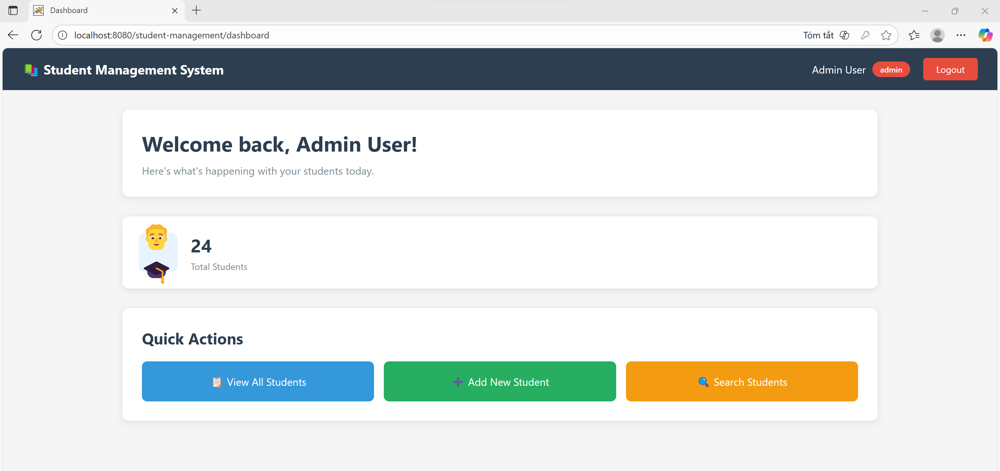
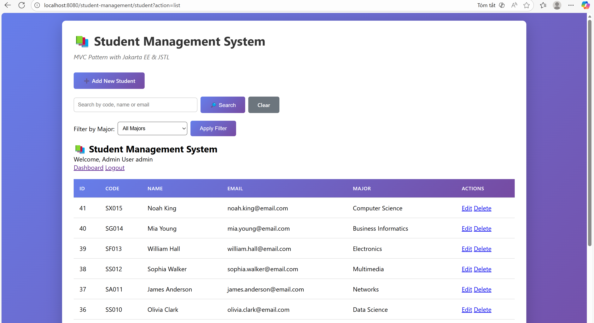
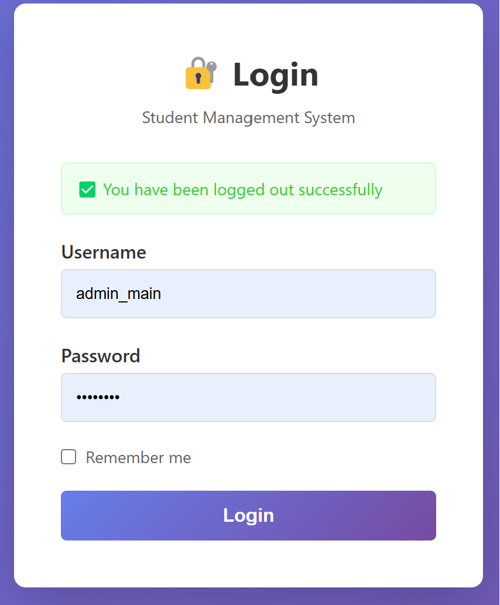
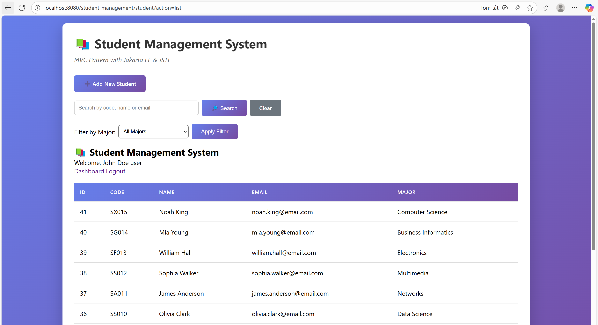
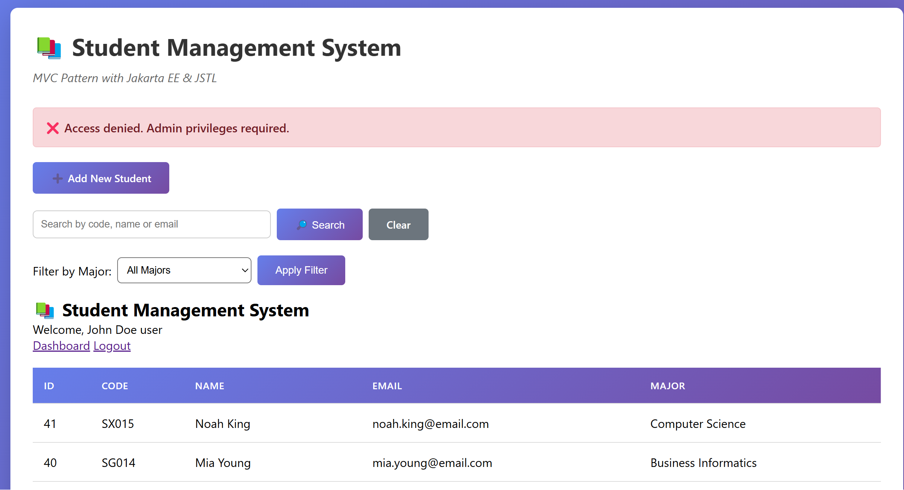

# Web-Application-Development-Lab-06
AUTHENTICATION &amp; SESSION MANAGEMENT

# Nguyễn Việt Thảo - ITCSIU23058 

## Explain Login flow

1. User accesses `GET /login` → `LoginController.doGet` returns `views/login.jsp`.

`LoginController`:
```java
User user = userDAO.authenticate(username, password);
if (user != null) {
	HttpSession old = request.getSession(false);
	if (old != null) old.invalidate();

	HttpSession session = request.getSession(true);
	session.setAttribute("user", user);
	session.setAttribute("role", user.getRole());
	session.setAttribute("fullName", user.getFullName());
	session.setMaxInactiveInterval(30 * 60);

	if (user.isAdmin()) response.sendRedirect("dashboard");
	else response.sendRedirect("student?action=list");
} else {
	request.setAttribute("error", "Invalid username or password");
	request.getRequestDispatcher("/views/login.jsp").forward(request, response);
}
```


2. User submits form → `POST /login` → `LoginController.doPost` gets `username`/`password`.

`login.jsp`
```java
<form action="login" method="post">
    <input type="text" id="username" name="username" value="${username}" required autofocus>
    <input type="password" id="password" name="password" required>
    <input type="checkbox" id="remember" name="remember">
    <button type="submit" class="btn-login">Login</button>
</form>
```

3. `LoginController` calls `UserDAO.authenticate(username, password)`:
	- Query user (only `is_active = TRUE`).
	- Compare password with `BCrypt.checkpw(plain, hashed)`.
    
`UserDAO.authenticate`:
```java
PreparedStatement p = conn.prepareStatement(SQL_AUTHENTICATE);
p.setString(1, username);
ResultSet rs = p.executeQuery();
if (rs.next()) {
	 String hashed = rs.getString("password");
	 if (BCrypt.checkpw(password, hashed)) {
		  user = mapResultSetToUser(rs);
		  updateLastLogin(user.getId());
	 }
}
```

4. If authentication fails → forward to `login.jsp` with `error`.
5. If authentication succeeds:
	- Invalidate old session (prevent session fixation).
	- Create new session: `session = request.getSession(true)`. 
	- Save information into session: 
	  - `session.setAttribute("user", user)` 
	  - `session.setAttribute("role", user.getRole())` 
	  - `session.setAttribute("fullName", user.getFullName())` 
	- `session.setMaxInactiveInterval(30 * 60)` (30 minutes). 
	- Redirect: admin → `/dashboard`, user → `/student?action=list`.


6. Then, `AuthFilter` checks `session.getAttribute("user")` for requests, if null → redirect `/login`.
7. `AdminFilter` protects admin actions (e.g. `new`, `insert`, `edit`, `update`, `delete`) by checking `user.isAdmin()`.

- **`AuthFilter.doFilter`**
```java
HttpSession session = httpRequest.getSession(false);
boolean isLoggedIn = (session != null && session.getAttribute("user") != null);
if (isPublicUrl(path) || isLoggedIn) chain.doFilter(request, response);
else httpResponse.sendRedirect(contextPath + "/login");
```

# Test Login Flow:

1. Access: http://localhost:8080/YourApp/
	- Expected: Redirected to login (handled by `AuthFilter`).


2. Login with admin account: `admin / password123`
	- Expected: Creates session; redirected to dashboard.



3. Click "View All Students"
	- Expected: Shows student list; Edit/Delete buttons visible (admin view).



4. Logout
	- Expected: Session invalidated; redirected to login.



5. Login with student account: `john / password123`
	- Expected: Regular user view; no Edit/Delete buttons visible.



6. Try to access: `/student?action=new`
	- Expected: `AdminFilter` blocks access; an error message is displayed or redirect to list with error.



